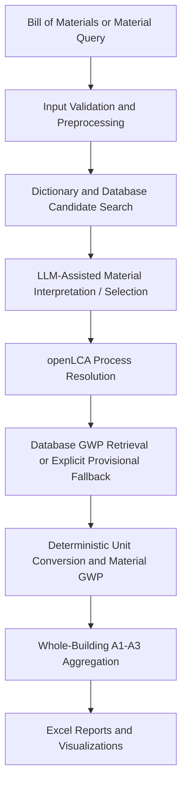

# LLM-Assisted Upfront Embodied-Carbon Screening

## Open-source workflow for building Bills of Materials, openLCA process matching, and A1-A3 screening

This repository contains the application code and reproducibility assets for the
research study currently framed as:

> **An LLM-assisted screening workflow for upfront embodied carbon assessment**

The workflow combines a locally deployable large language model (LLM), openLCA,
an environmental life-cycle inventory database, and a FastAPI interface to
support preliminary embodied-carbon screening of individual construction
materials and whole-building Bills of Materials (BOMs).

The repository should be interpreted as a **screening and research workflow**,
not as a certified LCA tool. Database-grounded results, documented proxies, and
provisional LLM-supported estimates are kept conceptually separate so their
provenance can be reviewed.

## Research status and reproducibility assets

The August 2026 reviewer-revision package now includes an explicit expert
reference-set workflow and the openLCA process catalog used to constrain expert
process selection.

- **35 BOM entries** from the three Nepal demonstration case studies are included
  in the expert-review workbook.
- **608 openLCA process descriptors** are included in the exported ELCD-labeled
  process catalog.
- Expert A and Expert B are intended to label the BOM entries independently.
- Expert disagreements are reconciled before any LLM output is scored.
- LLM outputs are intentionally hidden during initial expert labeling to reduce
  anchoring bias.
- The final model benchmark and ablation results should be added only after the
  expert reference has been completed.

See [`research_artifacts/README.md`](research_artifacts/README.md) and
[`docs/REPRODUCIBILITY.md`](docs/REPRODUCIBILITY.md) for the detailed workflow.

> **Important reproducibility item:** the exact release/version of the active
> ELCD database still needs to be recorded before final publication. The current
> catalog records the process descriptors and UUIDs, but the human-readable
> database release name is not reliably encoded by the IPC export itself.

## Assessment scope

The research workflow focuses on upfront embodied carbon within product-stage
life-cycle modules **A1-A3**:

| Module | Product-stage activity |
| --- | --- |
| **A1** | Raw-material supply |
| **A2** | Transportation to manufacturing |
| **A3** | Material manufacturing |

Results are reported as Global Warming Potential (GWP). The API exposes
`kg_co2e_per_kg` only when the selected openLCA process has a recognized mass
reference unit. For processes referenced by volume, area, or item, the response
retains `gwp_per_reference_unit` and `reference_unit` and explains why a
per-kilogram value was not calculated. This avoids dimensionally invalid BOM
aggregation.

## Workflow hierarchy

The research methodology distinguishes three pathways:

1. **Direct database match** — a sufficiently representative process is found in
   the active environmental database.
2. **Documented database proxy** — a technically defensible related process is
   used when an exact record is unavailable.
3. **LLM-supported provisional estimate** — the local model may provide a
   screening estimate only when a usable database result is unavailable.

LLM-supported emission factors should be treated as **provisional screening
values requiring review**, not as verified life-cycle inventory records.
Quantity conversion, multiplication, aggregation, and building-level summation
are performed deterministically by the application after the relevant inputs
have been resolved.

## Main features

- BOM spreadsheet processing;
- single-material embodied-carbon screening;
- material-name interpretation using a local LLM;
- material dictionary lookup and fuzzy process search;
- openLCA IPC queries;
- environmental process and emission-factor retrieval from the active database;
- unit conversion and material-level GWP calculation;
- whole-building A1-A3 aggregation;
- material hotspot identification;
- Excel report generation and contribution charts; and
- source, process, conversion, and message metadata for individual inventory
  items.

The environmental database used at runtime is the database currently open in
openLCA. To reproduce an ELCD-based experiment, activate the intended ELCD
release before starting the IPC server and record its exact version.

## Expert reference-set workflow

The repository contains:

`research_artifacts/expert_reference/LLM_LCA_Expert_Reference_Set_With_ELCD.xlsx`

The workbook contains separate sheets for Expert A, Expert B, and reconciliation.
For each BOM item, the experts independently record:

- normalized material;
- best available process from the exported process catalog;
- exact process UUID;
- Direct / Proxy / Review Required classification;
- confidence; and
- a short rationale where needed.

The workbook is currently an **evaluation template / in-progress reference set**.
Blank expert cells must not be treated as final labels or ground truth.

## openLCA process catalog

The repository also contains:

`research_artifacts/openlca/ELCD_Process_Catalog.xlsx`

This file contains **608 process descriptors** exported from the database active
in openLCA during the revision workflow. It includes process UUID, process name,
location, process type, category, and library fields where available. It is a
search/reference catalog and does not contain complete LCI exchanges or the full
database package.

To regenerate a machine-readable catalog from the active openLCA database:

```bash
python scripts/export_openlca_process_catalog.py --database-label "ELCD <exact version>"
```

The exporter uses the current `olca-ipc` / `olca-schema` API. Start openLCA and
its IPC server on port `8080` before running it.

## Framework architecture



## Project layout

```text
.
├── app
│   ├── controllers       # request and use-case controllers
│   ├── core              # lazy in-process Llama engine and exceptions
│   ├── models            # Pydantic and domain models
│   ├── routes            # FastAPI routers
│   ├── services          # openLCA, material, BOM, and unit workflows
│   ├── templates         # browser GUI
│   ├── utils             # XLSX, chart, JSON, and text helpers
│   ├── __init__.py       # application factory
│   └── config.py
├── docs
│   └── REPRODUCIBILITY.md
├── experiments
│   └── model_benchmark      # controlled four-model Comment 5 experiment
│       ├── benchmark_models.py
│       ├── score_benchmark.py
│       ├── bom_35_items.csv
│       ├── model_registry.json
│       └── Comment5_LLM_ELCD_Benchmark.ipynb
├── research_artifacts
│   ├── expert_reference
│   │   └── LLM_LCA_Expert_Reference_Set_With_ELCD.xlsx
│   ├── openlca
│   │   ├── CATALOG_METADATA.md
│   │   └── ELCD_Process_Catalog.xlsx
│   └── README.md
├── scripts
│   └── export_openlca_process_catalog.py
├── tests
├── main.py
├── requirements.txt
├── requirements-llama.txt
└── requirements-benchmark.txt
```

## Run the application

Create and activate a virtual environment, install the core requirements, and
start the FastAPI application.

### Windows PowerShell

```powershell
python -m venv .venv
.\.venv\Scripts\Activate.ps1
pip install -r requirements.txt
python main.py
```

### macOS / Linux

```bash
python3 -m venv .venv
source .venv/bin/activate
pip install -r requirements.txt
python main.py
```

Open `http://127.0.0.1:8000/`. Interactive API documentation is available at
`http://127.0.0.1:8000/docs`.

## openLCA configuration

Start openLCA, activate the intended database, and enable the IPC server on port
`8080`. The application reads `OPENLCA_HOST` and `OPENLCA_PORT` from the
environment.

Calculations have a configurable deadline
(`OPENLCA_CALCULATION_TIMEOUT_SECONDS`, 600 seconds by default), preventing a
stalled IPC job from indefinitely blocking later requests.

## Optional local Llama model

Install the additional LLM dependencies on a machine with a supported NVIDIA
CUDA or Apple MPS GPU:

```bash
pip install -r requirements-llama.txt
```

The current code default is:

```text
meta-llama/Llama-3.1-8B-Instruct
```

Override it using `LLAMA_MODEL_ID`. Model loading is lazy, so the FastAPI
application can start without the LLM runtime. Missing packages, unsupported
hardware, authorization failures, loading errors, and GPU out-of-memory
conditions are converted to a visible unavailable state rather than stopping
the GUI.

The default model in the code is an implementation setting, **not** a substitute
for the multi-model evaluation required by the research study. Any manuscript
benchmark should report the exact tested model IDs, prompt, decoding settings,
hardware, number of runs, and repeatability results.

## Controlled four-model benchmark for Reviewer Comment 5

A separate controlled benchmark is provided under
`experiments/model_benchmark/`. It evaluates Llama, Qwen, DeepSeek, and Mistral
on the language-model tasks that actually matter to this workflow rather than on
direct GWP-value guessing.

The default benchmark registry uses similarly sized instruction/chat models:

- `meta-llama/Llama-3.1-8B-Instruct`;
- `Qwen/Qwen2.5-7B-Instruct`;
- `deepseek-ai/deepseek-llm-7b-chat`; and
- `mistralai/Mistral-7B-Instruct-v0.3`.

All four models receive the same 35 BOM descriptions, identical deterministic
top-k candidate process lists from the exported 608-process catalog, the same
prompt, and greedy decoding (`do_sample=False`). The default final protocol uses
five repeats per BOM item and records the resolved Hugging Face commit SHA,
hardware, software versions, quantization, raw outputs, inference time, and
repeatability in machine-readable files.

The benchmark deliberately preserves `selected_candidate=-1` as
`Review Required`; it never silently converts an unresolved result into the
first candidate. Candidate retrieval is deterministic and model-independent in
this experiment, allowing retrieval recall and final model selection to be
measured separately after the expert reference set is reconciled.

See [`experiments/model_benchmark/README.md`](experiments/model_benchmark/README.md)
or open
[`Comment5_LLM_ELCD_Benchmark.ipynb`](experiments/model_benchmark/Comment5_LLM_ELCD_Benchmark.ipynb)
in Google Colab.

> **Model-name correction for the manuscript:** the current manuscript wording
> “LLaMA 3.2 8B” should not be retained if this experiment is reported. The
> benchmark and current application use `meta-llama/Llama-3.1-8B-Instruct` as
> the 8B Llama checkpoint; the exact runtime revision is recorded automatically.

## BOM upload safeguards

BOM uploads are streamed with a 25 MiB default limit. Expanded XLSX size, row,
cell, and Excel-column limits are also enforced. Override the raw upload limit
with `BOM_MAX_UPLOAD_BYTES`.

## Safety setting

The original prototype deleted matching product systems before recreating them.
This implementation safely reuses product systems by default. Enable recreation
only when explicitly required:

```bash
OPENLCA_RECREATE_PRODUCT_SYSTEMS=true python main.py
```

## Tests

```bash
python -m unittest discover -s tests -v
```

## Research-use notes

- The three Nepal buildings are demonstration cases rather than comprehensive
  validation cases.
- A commercial LCA platform comparison should be interpreted as comparative
  benchmarking rather than error-free ground truth.
- Database-backed coverage and successful numerical BOM processing are separate
  concepts.
- Provisional LLM estimates should remain visibly separated from database-backed
  calculations in reporting and interpretation.
- The exact openLCA version, database release, LCIA method, model settings, and
  hardware should be frozen and reported for the final reproducibility release.
